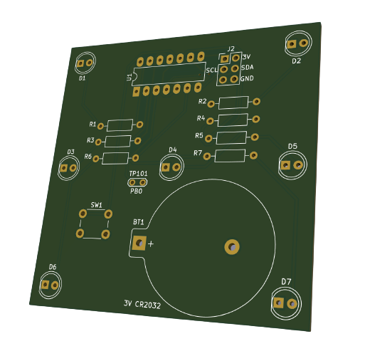
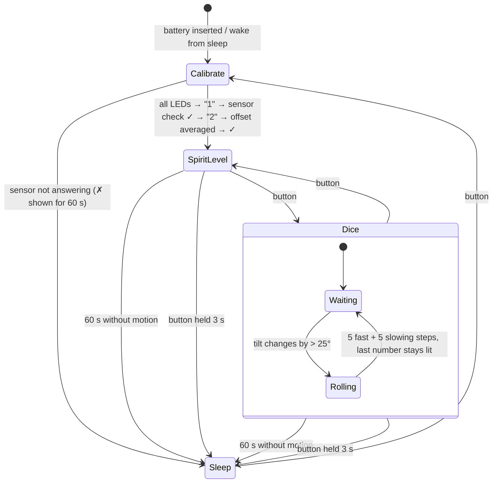

# AVR-Cube (Rev2)

**A coin-cell powered electronic dice and two-axis spirit level on an ATtiny24 — seven LEDs, one button, one accelerometer, and a bit-banged I²C bus that shares its pins with the ISP header.**

Shake it and it rolls a number; press the button and the same seven LEDs become a bubble level that follows the tilt of the board. It sleeps after a minute of stillness and wakes on the button, so a CR2032 lasts a long time. Designed as an easy, satisfying through-hole soldering kit: 25 parts, all on one side.



https://user-images.githubusercontent.com/38862049/217531555-265ecb9a-27d7-4d04-bca4-034f5620d8f7.mov

---

## Contents

- [How it works](#how-it-works)
- [Hardware](#hardware)
- [Firmware](#firmware)
- [Building and flashing](#building-and-flashing)
- [Repository layout](#repository-layout)
- [Status and known limitations](#status-and-known-limitations)
- [Author](#author)
- [License](#license)

---

## How it works

The whole device is one state machine driven by two interrupts: a 1 ms timer tick that counts idle time, and the button on `INT0`.



**Calibration** runs on every wake-up: it lights all LEDs (a visual LED test), reads the accelerometer's `WHO_AM_I` register over I²C, and averages ten samples to get the resting offset on each axis. That offset is what makes the spirit level read "flat" wherever the board happens to sit when powered on — there is no absolute calibration.

**Spirit level** reads X/Y/Z acceleration, subtracts the offset, and converts the X and Y components into roll and pitch angles with `atan(axis / z_offset)`. Within ±1° of level only the centre LED is lit; otherwise the LEDs on the side that is *down* light up — a whole edge if the tilt is along one axis, a single corner if it's diagonal.

**Dice** waits until the angle changes by more than 25° between two readings (a shake or a tilt), then rolls: five numbers at 100 ms, then five more with the delay growing by 100 ms each step, so the animation visibly slows down and settles. The random generator is seeded from the millisecond counter, so the result depends on exactly when you shook it.

**Sleep** puts the accelerometer in standby, switches every I/O pin to input, and enters `SLEEP_MODE_PWR_DOWN` — a few µA. Holding the button lights the LEDs 1…6 as a countdown; at 3 s it sleeps immediately.

## Hardware

| | |
|---|---|
| MCU | Microchip **ATtiny24** (DIP-14, 2 KB flash) at 8 MHz internal RC — the ATtiny84 is a drop-in alternative with more flash |
| Sensor | NXP **MMA8653FC** 3-axis accelerometer (DFN-10), I²C address `0x1D`, ±2 g, 8-bit fast-read mode |
| Display | 7 × 5 mm LEDs in the classic dice pattern, 100 Ω series resistors |
| Input | 6 mm tactile switch on `INT0` |
| Power | CR2032 in a Keystone 106 holder, 3 V direct — no regulator |
| Programming | 2×3 ISP header; the same pins carry the sensor's I²C bus |
| Board | 2-layer, single-sided assembly, KiCad 6 sources in [PCB/](PCB/), Gerbers in [PCB/Gerber/Rev26.09.22/](PCB/Gerber/Rev26.09.22/) |

### LED layout and pin map

```
        D1 ●     ● D2            D1  PA0     D5  PA5 (also MISO)
                                 D2  PA1     D6  PA7
        D3 ●  ●  ● D5            D3  PA2     D7  PB1
              D4                 D4  PA3

        D6 ●     ● D7            SW1  PB2 / INT0   (pull-up, active low)
                                 SCL  PA4 = SCK    (bit-banged, no USI)
   1 → D4   2 → D3 D5            SDA  PA6 = MOSI
   3 → D1 D4 D7   4 → corners    TP101 PB0 (spare, pulled up)
   5 → corners + D4   6 → all but D4
```

Sharing `SCK`/`MOSI` with `SCL`/`SDA` is what keeps the part count down: no dedicated I²C header, and the sensor doesn't mind the ISP traffic because the firmware drives the bus in software and the sensor ignores anything without a valid start condition addressed to it. `D5` sits on `MISO` and flickers while programming — harmless.

### Bill of materials

| Ref | Qty | Part | Footprint |
|---|:---:|---|---|
| U1 | 1 | ATtiny24-20PU (or ATtiny84) | DIP-14 |
| U2 | 1 | MMA8653FCR1 | DFN-10 2×2 mm — the only SMD part |
| D1–D7 | 7 | LED 5 mm | THT |
| R1–R7 | 7 | 100 Ω | axial 0207 |
| C1–C3 | 3 | 100 nF | 0603 |
| C4–C5 | 2 | 1 µF | 0603 |
| SW1 | 1 | tactile switch 6 mm | THT |
| BT1 | 1 | CR2032 holder, Keystone 106 | THT |
| J2 | 1 | pin header 2×3, 2.54 mm | THT |

The schematic ([PCB/avrCubeRev2.kicad_sch](PCB/avrCubeRev2.kicad_sch)) is the authoritative BOM; datasheets for every active part are in [Documentation/](Documentation/).

## Firmware

Everything lives in [AvrCubeV2Code/src/main.cpp](AvrCubeV2Code/src/main.cpp) and [main.hpp](AvrCubeV2Code/src/main.hpp) — bare-metal AVR C++ with no Arduino API calls, built with the PlatformIO `atmelavr` toolchain. Doxygen comments on every function; the generated reference is in [Documentation/Doxygen/documentation.pdf](Documentation/Doxygen/documentation.pdf).

Things worth knowing before you change it:

- **I²C is bit-banged** (`start()`, `stop()`, `tx()`, `rx()`) at ~100 kHz using the internal pull-ups — the ATtiny24's USI is not used so the pins can double as ISP. Interrupts are disabled during each register transaction.
- **The 1 ms tick** is Timer0 in CTC mode (prescaler 64, `OCR0A = 124` at 8 MHz). It only increments `counter`; `main()` compares it against `SLEEP_THRESHOLD` and any detected motion resets it.
- **Mode switching** is done by parity of `button_pressed`: the ISR increments it and re-enters `main()`, which re-initialises the peripherals and picks the branch. Odd = dice, even = spirit level; calibration leaves it at 2, so the device starts in level mode.
- **All tunables are `#define`s** at the top of `main.hpp`: sleep timeout, shake threshold, dice animation timing, level dead-band, hold-to-sleep time.

## Building and flashing

Requirements: [PlatformIO](https://platformio.org/) (CLI or VS Code extension) and an ISP programmer — an Arduino running *ArduinoISP* works, that's what `flashCommand.txt` assumes.

```bash
cd AvrCubeV2Code
pio run -e attiny24            # or -e attiny84
```

Flash with avrdude, setting the fuses for the internal 8 MHz oscillator with `CKDIV8` cleared (`lfuse 0xE2`); the default `hfuse 0xDF` keeps `RESET` usable so the chip stays re-programmable:

```bash
avrdude -p t24 -c avrisp -b 19200 -P /dev/ttyUSB0 \
  -U flash:w:.pio/build/attiny24/firmware.hex \
  -U lfuse:w:0xe2:m -U hfuse:w:0xdf:m -U efuse:w:0xff:m
```

Insert the coin cell after programming. The board should light all seven LEDs, show `1`, then a tick mark (✓) if the accelerometer answered, show `2` while it averages the offset, and a tick again — then it's in spirit-level mode. A cross (✗) after `1` means the I²C link to the sensor is broken; check the DFN-10 solder joints.

## Repository layout

```
AvrCubeV2Code/         PlatformIO project
  src/main.cpp, main.hpp   the whole firmware
  platformio.ini           attiny24 and attiny84 environments
  flashCommand.txt         avrdude invocation with fuse settings
  Doxygen/Doxyfile         doc generator config
PCB/                   KiCad 6 project (schematic, layout, footprint table)
  Gerber/Rev26.09.22/      latest production files (also Rev09.22, Rev1.0)
Documentation/         datasheets (ATtiny24, MMA8653FC, LED) and the Doxygen PDF
Resources/             board render, demo video, KiCad battery-holder footprints
```

## Status and known limitations

The Rev2 board is built, tested and works as shown in the video. Things left open in the firmware:

- **Angle maths is an approximation.** Roll and pitch use `atan(x / z_offset)` with the *calibrated* Z as the fixed reference rather than `atan2(x, sqrt(y²+z²))`. It's accurate near level and increasingly off beyond ~45°, which is fine for a bubble level but not for measuring angles. The NXP app note AN3461 has the exact formulas; the code comment already points at it.
- **Motion detection is rough.** `motionDetected()` compares the angle *gradient* to the threshold without `abs()`, so only changes in the positive direction trigger — and `getGradient()` keeps a single static previous value shared between the roll and pitch calls, so each "gradient" is really roll-minus-pitch of consecutive reads. Shaking still trips it reliably, which is all the dice needs, but it should be two independent deltas with `abs()`.
- **Offset lives in RAM.** Calibration repeats on every wake-up rather than storing the offset in the sensor's own offset registers (`OFF_X/Y/Z`), which the MMA8653FC supports.
- **Mode switching re-enters `main()` from the ISR**, which is a stack-growing trick rather than a clean state variable. It works because the device sleeps or is power-cycled long before the stack matters, but it's the first thing to refactor.
- **Flash is tight on the ATtiny24.** Float `atan` plus `rand` fits, but there is little room left; the ATtiny84 environment exists for that reason.

## Author

Fabian Franz, 2022.

## License

Firmware, schematic and board layout: [MIT](LICENSE). Datasheets in `Documentation/` belong to their respective manufacturers.
